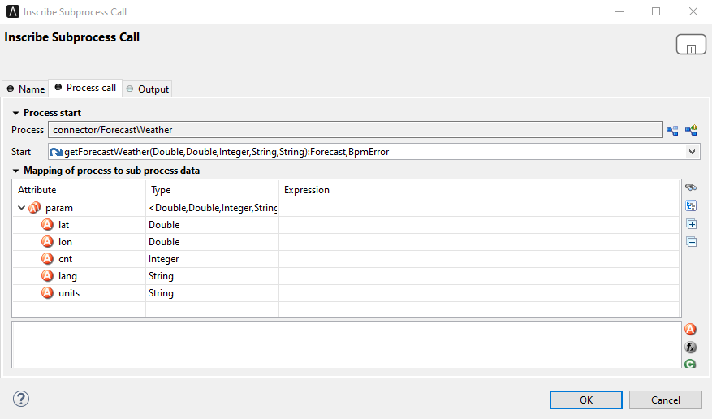

# Open Weather Connector

Harness the power of freely available weather data in your applications with the Open Weather Connector! This tool streamlines access to OpenWeatherMap's comprehensive datasets, offering a wealth of valuable information within their free plan:

* **Real-time weather:** Get current conditions for any location worldwide.
* **Extended forecasts:** Plan ahead with multi-day predictions.
* **Air quality:** Optimize user experience based on environmental factors.
* **Geocoding:**
	* **Address to coordinates:** Convert physical addresses to precise latitude and longitude values.
	* **Coordinates to address:** Obtain the corresponding address for a given latitude and longitude.

 

## Demo

Install the Open Weather Connector and execute it as a subprocess, providing corresponding parameter values for each field:

 

 

Within the demo, users can access to retrieve comprehensive **5-day weather forecasts** for any global location. Follow these straightforward steps:

1. **Precise Location Specification:** Accurately identify the desired location by entering the city name and its corresponding country code. For locations within the United States, the inclusion of the state code further refines the forecast.
2. **Initiate Search:** Simply click the **Search** button to activate the retrieval process. The connector will efficiently retrieve and display a detailed **5-day forecast** specific to your chosen location.

## Setup

The use of the Open Weather Map API is not free of charge. For development purposes there is a free version with minimal API calls. To use the connector, you must select a suitable API package via the [Open Weather Map API Developer](https://openweathermap.org/api) and generate a **app id**. This is described in the following guideline: [OpenWeatherMap guide](https://openweathermap.org/guide)

After a **app id** is available, you can store it in your project in the variables.yaml as the variable "openWeatherConnector.appId" (as you can see in the Demo).

 