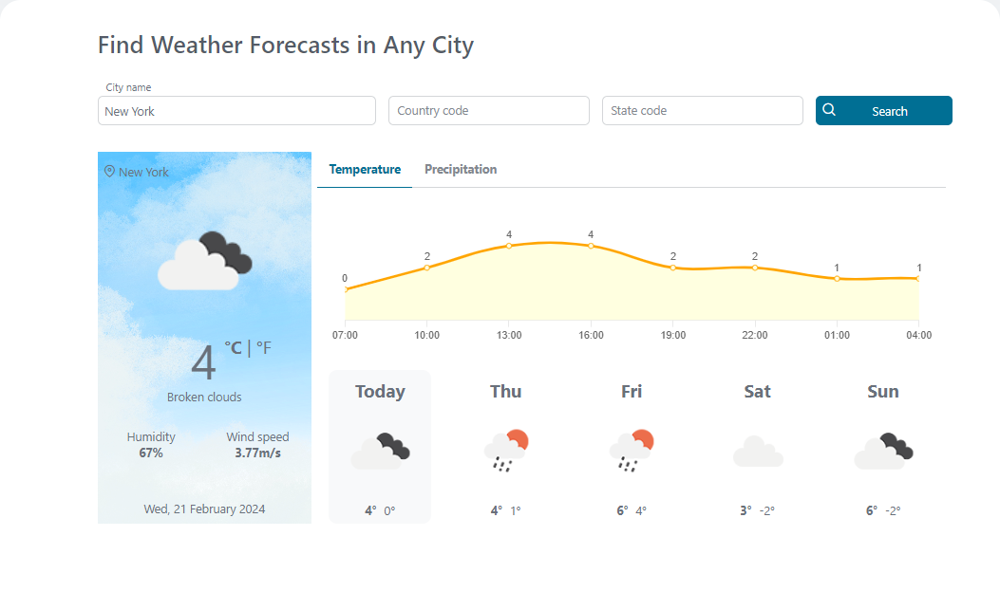
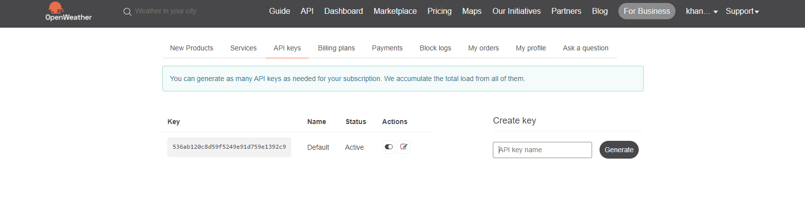
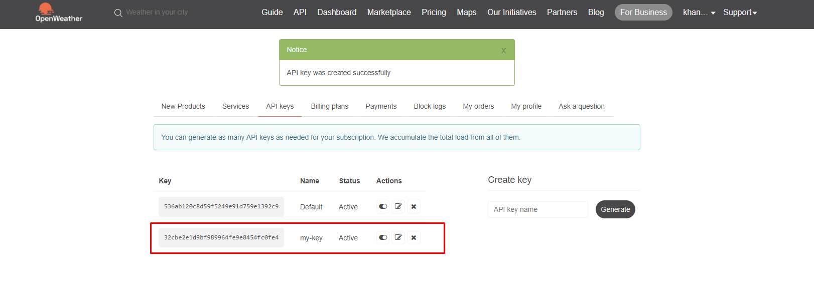

# OpenWeather Connector

Harness the power of freely available weather data in your business processes with OpenWeather! This Axon Ivy connector streamlines access to OpenWeatherMap's comprehensive datasets, offering a wealth of valuable information within their free plan:

* **Real-time weather:** Get current conditions for any location worldwide.
* **Extended forecasts:** Plan ahead with multi-day predictions.
* **Air quality:** Optimize user experience based on environmental factors.
* **Geocoding:**
	* **Address to coordinates:** Convert physical addresses to precise latitude and longitude values.
	* **Coordinates to address:** Obtain the corresponding address for a given latitude and longitude.
* Supports you with an easy-to-copy demo implementation to reduce your integration effort.

## Demo

Within this demo, users can access comprehensive **5-day weather forecasts** for any location worldwide. Follow these simple steps:

1. **Precise Location Specification:** Accurately identify the desired location by entering the city name and its corresponding country code. For locations within the United States, the inclusion of the state code further refines the forecast.
2. **Initiate Search:** Simply click the **Search** button to activate the retrieval process. The connector will efficiently retrieve and display a detailed **5-day forecast** specific to your chosen location.



## Setup

### Application ID
The OpenWeatherMap weather API is not free to use. However, there is a free version with minimal API calls for development purposes. To use the connector, select a suitable API package via the [OpenWeatherMap API Developer](https://openweathermap.org/api) and generate an **API key**.

##### How to get an API key
1. Login and go to your [OpenWeatherMap API keys page](https://home.openweathermap.org/api_keys)
2. Add your API key name and generate it:

3. API key now is available:


After a **API key** is available, you can store it in your project in the variables.yaml as the variable "openWeatherConnector.appId":

```
@variables.yaml@ 
```
